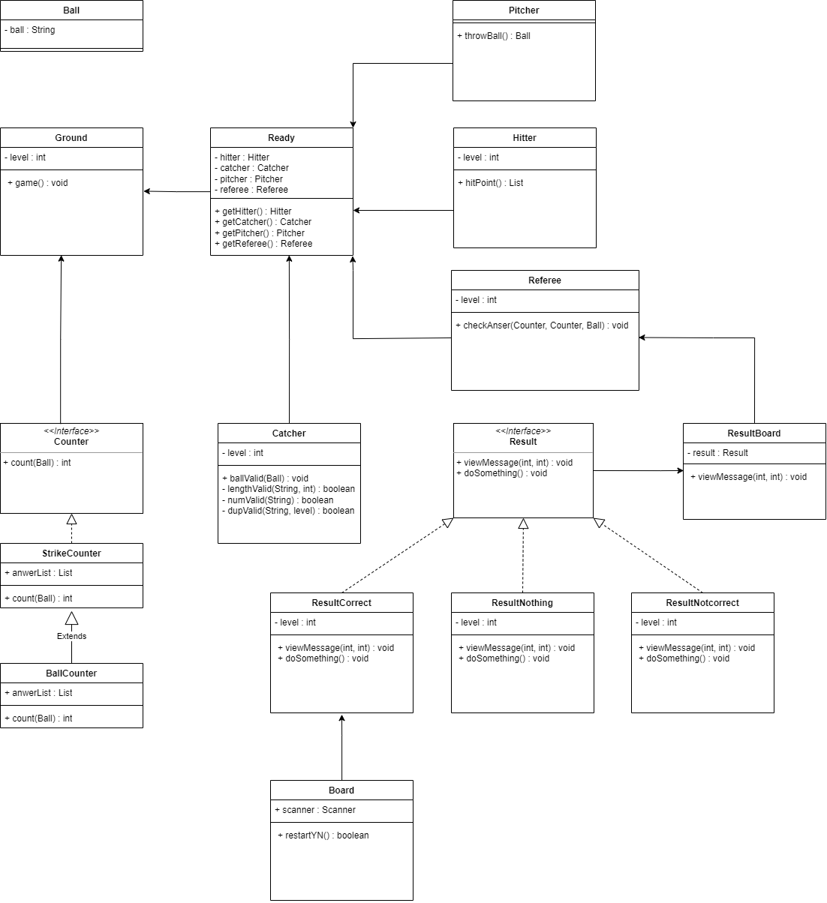

# BaseBall

## 요구사항
* 1 ~ 9 중 서로 다른 수로 이루어진 3자리의 수를 맞추는 게임
* 플레이어는 3자리의 수를 입력 가능
* 플레이어는 중복된 수를 입력 가능
* 입력한 숫자와 정답 간 일치하는 숫자가 있으면 볼이나 스트라이크
* 일치하는 숫자의 위치가 같으면 스트라이크
* 일치하는 숫자의 위치가 다르면 볼
* 일치하는 숫자가 하나도 없다면 낫싱
* 3스트라이크라면 아웃
* 아웃시킬 때까지 반복하고 아웃시키면 게임 종료
* 종료 후 1을 입력하면 게임을 재시작하고 2를 입력하면 프로그램 종료
* 잘못된 값을 입력하면 IllegalArgumentException 예외가 발생

---
### 1. 구현 목표
* 요구사항 기능 구현
* 전략 패턴 적용
* 인터페이스를 사용해서 다형성 적용
* 객체를 SOILD원칙을 지킬 수 있게 분리

---

### UML

---

### 2. 자체 평가
* 필요성이 떨어지는 객체들을 남발해서 더 복잡해짐
* 협력에 대한 이해 부족
* 설계를 충분히 하지 않아서 작업중에 수정된 사항이 많음